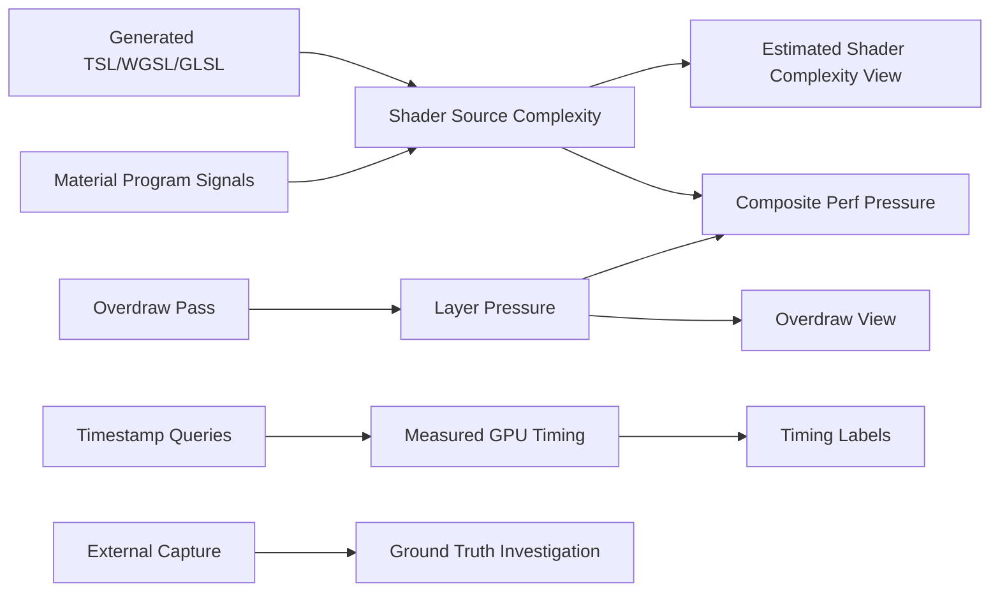

# SDD: Shader Complexity / Performance Debug View

## Current Truth

This feature must not pretend to expose a native GPU instruction count.

Three.js + browser WebGPU can provide:

- generated shader / material program signals
- render-pass outputs
- overdraw-style debug passes
- optional GPU timestamp query timing where supported

It cannot reliably provide:

- per-material native GPU instruction count
- per-pixel real hardware shader cost
- exact loop/sample cost for arbitrary custom TSL/POM without shader-source or explicit metadata

So the correct target is:

```text
Estimated Shader Complexity + Overdraw + Optional Timing Validation
```

Not:

```text
Real UE5 Shader Complexity clone
```

## Research Baseline

Other engines split this problem instead of solving it with one number:

- Unreal Shader Complexity uses shader instruction count, but still documents it as approximate.
- Unreal Quad Overdraw is a separate view because pixel pressure is different from shader instruction count.
- Unity/Godot overdraw modes use debug/replacement rendering and do not preserve arbitrary custom shader truth.
- RenderDoc is closer to real frame truth, but it is an external capture tool, not a runtime app view.

## Four Approaches Toward the Most Real Version

### Approach 1: Generated Shader Source Complexity

**Question answered:** how complex is the shader program?

Use generated TSL/WGSL/GLSL when accessible, then derive complexity from the emitted shader source.

Signals:

- fragment shader source length
- texture sampling count
- branch count
- loop count
- function call count
- derivative usage
- discard/alpha-test usage
- known expensive functions

Why this is better than hardcoded weights:

- custom TSL nodes become visible through generated shader code
- POM can be detected by loops / repeated texture sampling
- material type is no longer the only source of truth

Limits:

- source complexity is still not native hardware instruction count
- compiler optimization and GPU architecture can change real cost
- runtime loop iteration count may be data dependent

Acceptance:

- no hardcoded per-material cost table
- custom TSL shader produces a different complexity score when generated source changes
- POM-like shader with looped texture reads scores higher than flat texture shader

### Approach 2: Transparent Overdraw / Layer Pressure

**Question answered:** how many times is this pixel being shaded/blended?

Add a separate overdraw pass. This is required for glass behind glass, particles, foliage, decals, and other layered content.

Signals:

- additive layer accumulation
- transparent-object pressure
- optional alpha-tested-object pressure
- separate opaque/transparent channels if needed

Why this is required:

- one glass pane and four stacked glass panes can have the same shader program
- the real screen cost changes because pixels are shaded/blended multiple times

Limits:

- an overdraw pass measures pressure, not shader complexity
- replacement-material overdraw can miss custom shader discard behavior unless alpha/coverage is preserved

Acceptance:

- stacked transparent panes get hotter as layer count increases
- overdraw view can be shown independently from shader complexity
- final composite can multiply shader complexity by overdraw pressure

### Approach 3: Isolated GPU Timing Validation

**Question answered:** did this pass/object group actually take GPU time?

Use WebGPU timestamp queries where available. Treat timing as validation metadata, not a per-pixel heatmap source.

Signals:

- whole debug pass GPU time
- isolated object/material group GPU time
- before/after timing when toggling expensive material features

Why this matters:

- source complexity can be wrong
- GPU timing can expose texture bandwidth, blending, and driver/compiler effects

Limits:

- browser/platform support is feature-gated
- timing is noisy
- per-object timing requires additional isolated renders and can be expensive
- timestamp timing is not instruction count

Acceptance:

- app works when timestamp support is unavailable
- timing never blocks rendering
- timing labels are marked as measured GPU time, not shader cost

### Approach 4: External Capture / Expert Mode

**Question answered:** what does the actual frame look like to GPU tooling?

Provide an expert path for RenderDoc/browser GPU debugging instead of pretending the runtime app can expose everything.

Signals:

- draw calls
- generated shaders
- pipeline state
- render targets
- overdraw inspection where available
- GPU/debugger-specific shader stats if the platform exposes them

Why this belongs in the SDD:

- this is the closest to real frame truth
- it avoids lying inside the app UI
- it gives advanced users a path when in-app estimates disagree with reality

Limits:

- not portable inside the web app
- not available to every end user
- not suitable for always-on runtime UI

Acceptance:

- docs explain when to use external capture
- internal UI labels estimated views clearly
- export/debug metadata can help correlate objects/materials with captured draw calls

## Final Data Model



## Revised Implementation Plan

## Skills / Workstreams

This feature crosses rendering, shader analysis, runtime instrumentation, and UX truth-labeling. Treat each as a separate workstream; mixing them is how this becomes fake.

### Skill 1: Three.js / TSL Render Graph

Owns:

- where debug sources are declared
- how `PassNode` outputs become compositor inputs
- how TSL heatmap visualization stays presentation-only

Relevant files:

- `components/debug-views/debug-views-post.tsx`
- `components/debug-views/debug-render-plan.ts`
- `components/debug-views/debug-views-tsl/compositor.ts`
- `components/debug-views/debug-views-tsl/visualize.ts`

### Skill 2: Shader Source / Program Analysis

Owns:

- material program-signal extraction
- generated WGSL/GLSL/TSL source analysis when available
- explainability payloads for "why is this object hot?"

Relevant files:

- `components/debug-views/shader-cost/material-cost.ts`
- future: `components/debug-views/shader-cost/shader-source-cost.ts`
- future: `components/debug-views/shader-cost/shader-cost-explain.ts`

### Skill 3: Overdraw / Pixel Pressure

Owns:

- transparent layer pressure
- glass-behind-glass fixtures
- additive or counter-style overdraw pass
- independent `overdraw` debug source

Relevant files:

- future: `components/debug-views/overdraw/overdraw-pass.ts`
- future: `components/debug-views/overdraw/overdraw-materials.ts`
- `src/components/Scene.tsx`

### Skill 4: Measurement / Validation

Owns:

- optional WebGPU timestamp query support
- pass-level timing labels
- external capture documentation
- keeping measured timing separate from per-pixel estimated heatmaps

Relevant files:

- future: `components/debug-views/gpu-timing/`
- `packages/docs/src/content/docs/guides/built-in-views.mdx`
- `packages/docs/src/content/docs/reference/api.mdx`

## Execution Plan

### Phase 0: Contract Cleanup

Goal: stop lying in UI/API/docs.

- Rename user-facing `Shader Cost` copy to `Estimated Shader Complexity`.
- Keep internal `shaderCost` identifiers only if migration cost is not worth it yet.
- Add docs note: not native GPU instruction count.

Done when:

- UI label is truthful.
- docs do not imply UE5 parity.

### Slice 1: Rename and Truthful Contract

- Rename/copy label from `Shader Cost` to `Estimated Shader Complexity`.
- Keep heatmap presentation.
- Add docs that this is not native instruction count.

### Phase 1: Program-Signal Baseline

Goal: replace hardcoded weights with deterministic program signals.

- Keep material program-signal inference explicit and allowlisted; do not enumerate arbitrary Three.js object fields.
- Add visible explanation data for hovered/selected object later.
- Normalize against a stable global signal scale so the same material does not become white just because it is the most complex object in a simple scene.
- Add regression fixtures for:
  - MeshBasic
  - MeshStandard
  - MeshPhysical
  - transparent physical glass
  - custom material / node material placeholder

Done when:

- no per-material magic weight table exists
- tests assert relative complexity plus cheap-band sanity for simple primitives
- default material/render-state fields do not dominate the score

### Slice 2: Replace Weight Table With Program/Shader Signals

- Remove per-material magic weights.
- Use material program signals immediately.
- Add generated shader source analysis when Three exposes enough shader builder state.
- Preserve a debug explanation payload: `why is this object hot?`

### Phase 2: Generated Shader Source Analysis

Goal: make custom TSL and POM visible.

- Investigate stable access to generated shader source from Three's render pipeline.
- Add source analyzer for:
  - texture sample calls
  - loops
  - branches
  - discard / alpha kill
  - derivatives
  - known expensive functions
- Use source score over material-signal score when source is available.

Done when:

- custom TSL changes can alter complexity score
- POM-like shader scores above flat texture shader
- fallback remains material signals when source is unavailable

### Slice 3: Add Overdraw / Layer Pressure

- Add independent `overdraw` source.
- Add stacked glass fixture.
- Keep overdraw selectable alone.

### Phase 3: Overdraw / Layer Pressure

Goal: catch glass behind glass and layered content.

- Add `overdraw` source to debug view definitions.
- Add overdraw pass with cheap materials.
- Preserve alpha/coverage enough to avoid lying about cutouts.
- Add fixtures:
  - one glass pane
  - two stacked glass panes
  - four stacked glass panes
  - alpha-tested foliage/card

Done when:

- stacked transparent layers become progressively hotter
- overdraw is independently selectable
- composite pressure can use `shaderComplexity * overdraw`

### Slice 4: Add Timing / Expert Validation

- Add optional timestamp timing labels.
- Add docs for external capture workflow.
- Do not merge timing into per-pixel heatmap unless clearly marked.

### Phase 4: Timing / Expert Validation

Goal: validate estimates against actual GPU time where possible.

- Add feature-gated timestamp query support.
- Show pass/group timing as labels, not heatmap truth.
- Add docs for RenderDoc/browser GPU capture workflow.
- Add exportable debug metadata to correlate objects/materials with draw calls.

Done when:

- app works without timing support
- timing failures are non-fatal
- docs explain when to trust estimates vs external capture

## Must Not Do

- Do not hardcode “real” costs by material class.
- Do not call material feature weights “real shader cost.”
- Do not collapse shader complexity, overdraw, and timing into one unexplained number.
- Do not make replacement debug materials hide the fact that custom shaders/POM may be missed.
- Do not imply WebGPU exposes native shader instruction counts.

## Verification

For code changes:

```bash
pnpm typecheck
pnpm test
git diff --check
```

For doc-only changes:

```bash
git diff --check
```
